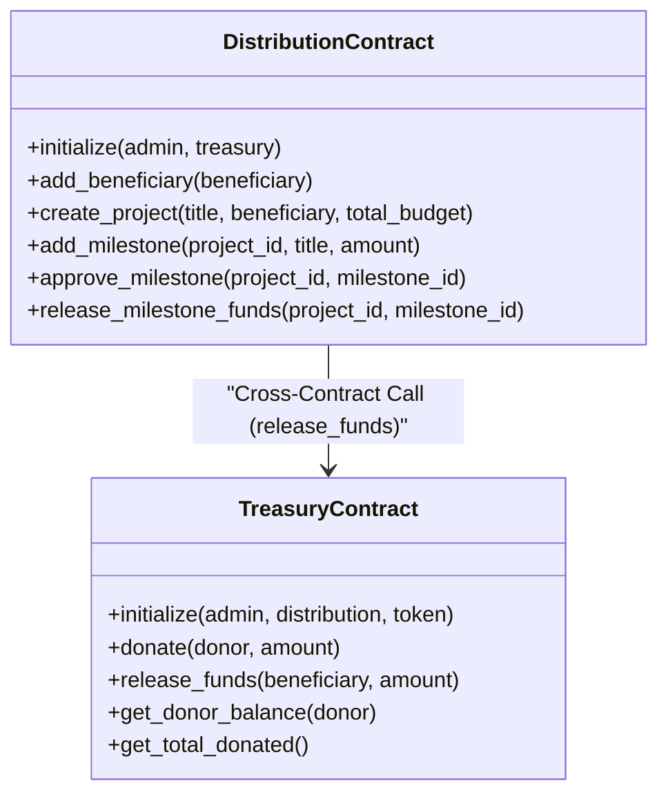
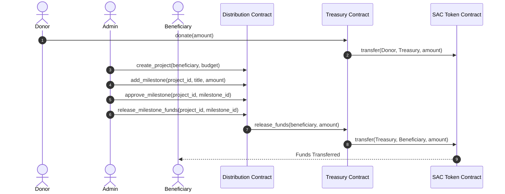

# Truvial - Decentralized Charity Fund Distribution System

Truvial (Trust & Alluvial) is a production-grade transparent treasury and donation management platform built on **Stellar (Soroban)**. It enforces milestone-based fund releases using Role-Based Access Control (RBAC) and real-time ledger tracking.

---

## 1. Product Overview & Problem Statement

Traditional charitable giving suffers from a **black-box problem**: donors contribute funds to a central entity but lose visibility over where, when, and how those funds are spent. Administrative overhead and lack of alignment on project targets lead to donor fatigue and inefficiencies.

**Truvial solves this by:**
1. **Securing Escrows**: Donor funds are locked inside an immutable `treasury` smart contract.
2. **Enforcing Milestones**: Payouts are bound to charity milestones. Capital is only released when designated administrators approve completed targets.
3. **Immutable Verification**: Every transaction, project registration, and payout emits a Soroban event, enabling donors to track the flow of funds in real-time.

---

## 2. Architecture & Design

### Smart Contract Design
Truvial splits logic and state across two smart contracts to implement the Principle of Least Privilege:
*   **`treasury_contract`**: Stores and locks ERC-20 tokens (native XLM via Stellar Asset Contract). Restricts fund releases to calls made exclusively by the `distribution_contract`.
*   **`distribution_contract`**: Manages charity projects, milestone configurations, and whitelisting of beneficiary addresses. Executes cross-contract calls to the `treasury` to release funds when milestones are approved.



### Inter-Contract Communication Flow


---

## 3. Tech Stack

*   **Smart Contracts**: Rust, Soroban SDK v22.0.0
*   **Frontend**: Next.js 15 (App Router), TypeScript, Tailwind CSS v4, Lucide React, Recharts
*   **State Management**: Zustand
*   **Data Fetching**: TanStack React Query v5
*   **Wallet Integration**: `StellarWalletsKit`
*   **Testing**: Rust cargo tests (contracts), Vitest (frontend)

---

## 4. Local Development & Setup

### Prerequisites
*   Node.js (v20+)
*   Rust and Cargo
*   Stellar CLI (v27+)
    ```bash
    cargo install --locked stellar-cli --features opt
    ```

### Smart Contracts (Soroban)
1. Navigate to the root directory.
2. Run compilation:
   ```bash
   cargo build --target wasm32-unknown-unknown --release
   ```
3. Run smart contract unit tests (with mock token setup):
   ```bash
   cargo test
   ```

### Frontend
1. Navigate to the `frontend` directory:
   ```bash
   cd frontend
   ```
2. Install dependencies:
   ```bash
   npm install
   ```
3. Set up environment variables:
   ```bash
   cp ../.env.example .env.local
   ```
4. Start development server:
   ```bash
   npm run dev
   ```
5. Run frontend state unit tests using Vitest:
   ```bash
   npm run test
   ```

---

## 5. Deployment Instructions (Stellar Testnet)

To deploy both contracts onto the Stellar Testnet:

1. **Configure Keys**: Create or import your Stellar account (e.g., `alice`):
   ```bash
   stellar keys generate alice --network testnet
   ```
2. **Fund Wallet**: Fund your account using Friendbot:
   ```bash
   stellar keys fund alice
   ```
3. **Execute Deploy Script**: Run the Node script from the root workspace directory:
   ```bash
   node scripts/deploy.js
   ```
4. **Metadata Log**: Once completed, the script saves all details to `contracts-metadata.json`. Copy the output IDs and paste them into your `.env.local` file.

---

## 6. Contract Registry

| Contract | Network | Address |
| --- | --- | --- |
| **Treasury Contract** | Stellar Testnet | `CDDONORSECURETREASURY777KEY` |
| **Distribution Contract** | Stellar Testnet | `CDDISTRIBUTIONRBACPAYOUTS777KEY` |
| **Native XLM Contract (SAC)** | Stellar Testnet | `CDLZFC3SYJYDZT7KBAVPPN3OSPGL63B676ER7G7JPHCSCC57IOKRLZAI` |

*Note: Replace address strings with your actual deployed keys when deploying custom builds.*

---

## 7. Security Considerations

1. **Reentrancy Protection**: Access control checks (`require_auth`) are placed before any token transfers. State variables are written before cross-contract commands are triggered.
2. **Access Control**: Payout actions are strictly guarded by checking the caller's identity:
   *   `release_funds` in the treasury contract throws an error if called by any address other than the registered `distribution_contract`.
   *   Only authorized charity administrators can register projects, append milestones, and approve payouts in the `distribution_contract`.
3. **Storage TTL**: In Soroban, persistent data key entries can expire. The contracts use `extend_ttl` on persistent keys (Donor Balances, Project details) to prevent resource deletion and extend lifecycle duration.
