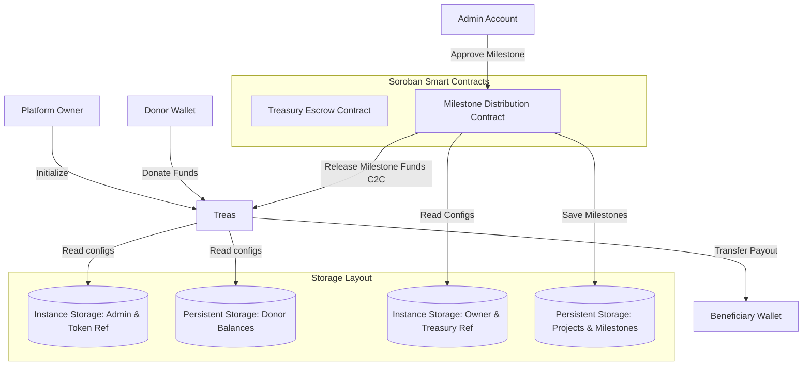
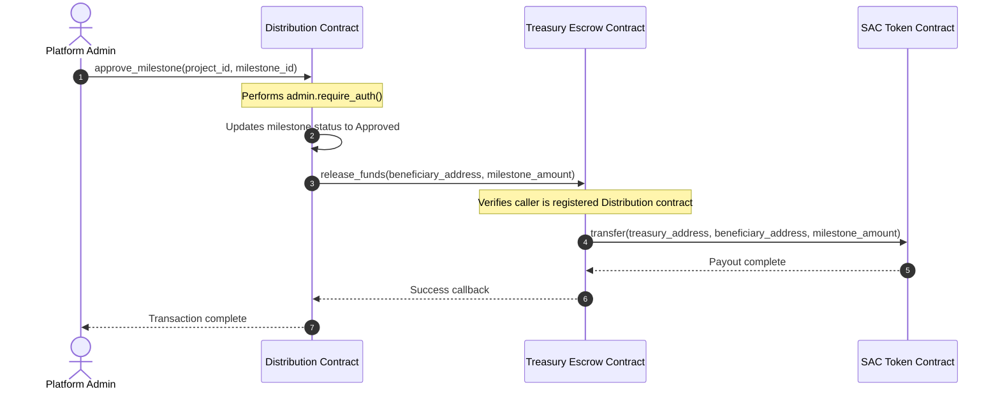

<h1 align="center">Truvial Charity Escrow & Distribution</h1>

<p align="center">
  <strong>A Decentralized, Milestone-Based Charity Treasury Management Platform built on the Stellar network using decoupled Soroban smart contracts.</strong>
</p>

<p align="center">
  <a href="https://github.com/lovehopemy52-ux/Creda/actions/workflows/ci-cd.yml" target="_blank">
    
  </a>
</p>

<p align="center">
  <a href="#overview">Overview</a> •
  <a href="#tech-stack">Tech Stack</a> •
  <a href="#directory-structure">Directory Structure</a> •
  <a href="#architecture">Architecture</a> •
  <a href="#development">Development</a> •
  <a href="#deployment-guide">Deployment Guide</a>
</p>

---

* **GitHub Repository:** [lovehopemy52-ux/Creda](https://github.com/lovehopemy52-ux/Creda)

---

## Table of Contents

* [1. Product Overview & Problem Statement](#overview)
  * [The Problem](#the-problem)
  * [The Truvial Solution](#the-truvial-solution)
* [2. Technical Stack](#tech-stack)
* [3. Directory Structure](#directory-structure)
* [4. Technical Architecture & Component Flow](#architecture)
  * [1. Decoupled Access Control Flow](#decoupled-flow)
  * [2. Inter-Contract Communication Sequence](#inter-contract-communication)
* [5. Smart Contract Design](#contract-design)
  * [Data Storage & TTL Preservation](#storage-design)
  * [Access Control](#access-control)
* [6. Local Development & Testing](#development)
  * [Prerequisites](#prerequisites)
  * [Compilation & Testing](#compilation-testing)
  * [Frontend Development](#frontend-dev)
* [7. Stellar Testnet Deployment Guide](#deployment-guide)
  * [Step 1: Configure Deployer Identity](#deployer-identity)
  * [Step 2: Compile WASM Bytecodes](#compile-wasm)
  * [Step 3: Deploy Charity Treasury](#deploy-treasury)
  * [Step 4: Deploy Milestone Distribution](#deploy-distribution)
  * [Step 5: Initialize Contracts & Configure Escrow](#initialize-contracts)
* [8. Deployed Contract Verification](#verification)
  * [On-Chain Contract Verification Links](#verification-links)
* [9. Security Considerations](#security)

---

<a name="overview"></a>
## 1. Product Overview & Problem Statement

### The Problem
Traditional charitable giving suffers from a lack of transparency and real-time accountability. Donors contribute capital to centralized organizations but lose visibility over how, when, and where their funds are spent. Administrative inefficiencies, lack of verification on completed goals, and misappropriation of capital lead to donor fatigue and reduced trust in global philanthropy.

### The Truvial Solution
Truvial resolves these structural limitations using:
* **Decoupled Treasury Escrow**: Donor funds are locked securely in an immutable `Treasury` smart contract, completely separated from the distribution logic.
* **Milestone-Based Releases**: Capital is only disbursed to beneficiaries when specific project milestones are completed and verified by designated administrators.
* **Contract-to-Contract (C2C) Payout Calls**: The `Distribution` contract manages project registries, whitelist configurations, and approval checks. It executes cross-contract calls to the `Treasury` to release milestone payouts only when strict validation criteria are met.

---

<a name="tech-stack"></a>
## 2. Technical Stack

* **Smart Contracts:** Rust, Soroban SDK (pinned to `v22.0.0` for maximum environment compatibility)
* **Frontend:** Next.js 16 (App Router), TypeScript, Tailwind CSS, lucide-react
* **State Management:** Zustand (wallet session persistence, transaction logs)
* **Data Querying:** React Query (RPC state status synchronization)
* **Wallet Connection:** `@creit.tech/stellar-wallets-kit` SDK (Freighter / xBull / LOBSTR)
* **Web3 Design Aesthetics:** Premium dark-mode aesthetic with custom radial glows, animated burger menu, copy address button, and custom Sun/Moon theme toggler.

---

<a name="directory-structure"></a>
## 3. Directory Structure

The project is organized with a feature-based architecture separating smart contracts, deployment tools, and the Next.js frontend app:

```
Truvial/
├── .github/
│   └── workflows/
│       └── ci-cd.yml                  # CI/CD Pipeline Configuration
├── contracts/
│   ├── treasury/
│   │   ├── src/
│   │   │   ├── lib.rs                 # Treasury escrow contract & storage
│   │   │   └── test.rs                # Treasury unit test suite
│   │   └── Cargo.toml                 # Treasury manifest
│   └── distribution/
│       ├── src/
│       │   ├── lib.rs                 # Milestone contract rules & C2C calls
│       │   └── test.rs                # Distribution unit test suite
│       └── Cargo.toml                 # Distribution manifest
├── frontend/
│   ├── src/
│   │   ├── app/
│   │   │   ├── dashboard/             # Admin workspace
│   │   │   ├── settings/              # Settings & Custom Contract binding
│   │   │   └── page.tsx               # Home & Public Verification page
│   │   ├── components/                # Header, Footer, Providers
│   │   ├── services/
│   │   │   └── stellar.ts             # Transaction building & signing layers
│   │   └── state/
│   │       └── wallet.ts              # Zustand wallet status manager
│   │       └── tx.ts                  # Zustand transaction status store
│   ├── package.json                   # Frontend node packages
│   └── tsconfig.json                  # TypeScript settings
└── Cargo.toml                         # Workspace Cargo configuration
```

---

<a name="architecture"></a>
## 4. Technical Architecture & Component Flow

<a name="decoupled-flow"></a>
### 1. Decoupled Access Control Flow



<a name="inter-contract-communication"></a>
### 2. Inter-Contract Communication Sequence



---

<a name="contract-design"></a>
## 5. Smart Contract Design

<a name="storage-design"></a>
### Data Storage & TTL Preservation
* **Instance Storage**: Used for configurations, referencing target contract variables, and owner parameters (e.g. `Admin`, `Distribution`, and `Token` references in the treasury contract) to optimize transaction footprints.
* **Persistent Storage**: Holds user balance registers (`DonorBalance`), projects, and milestone structures (`Project`, `Milestone`) with Soroban state leases to guarantee permanent storage integrity.

<a name="access-control"></a>
### Access Control
* **Authorization Enforcement**: Every state-modifying function enforces authorization signatures using `address.require_auth()`.
* **Inter-Contract Verification**: The Treasury contract verifies that the caller address matches the registered `Distribution` contract dynamically via a caller identity check during `release_funds`.

---

<a name="development"></a>
## 6. Local Development & Testing

<a name="prerequisites"></a>
### Prerequisites
* Rust & Cargo (with `wasm32v1-none` target configured)
* Node.js v20+

<a name="compilation-testing"></a>
### Compilation & Testing
```bash
# Run contract unit tests
cargo test

# Compile optimized WASM binaries
cargo build --target wasm32v1-none --release
```

<a name="frontend-dev"></a>
### Frontend Development
```bash
cd frontend
npm install --ignore-scripts
npm run dev
```

---

<a name="deployment-guide"></a>
## 7. Stellar Testnet Deployment Guide

<a name="deployer-identity"></a>
### Step 1: Configure Deployer Identity
Generate and fund a test account:
```bash
stellar keys generate tiyu --network testnet --fund
```

<a name="compile-wasm"></a>
### Step 2: Compile WASM targets
```bash
cargo build --target wasm32v1-none --release
```
This generates the optimized WASM files in `target/wasm32v1-none/release/`.

<a name="deploy-treasury"></a>
### Step 3: Deploy Charity Treasury
```bash
stellar contract deploy \
  --wasm target/wasm32v1-none/release/truvial_treasury.wasm \
  --source-account tiyu \
  --network testnet \
  --alias truvial_treasury
```
* **Output Address**: `CAF6HNIVLT63MSPNEU4HFZKUOBNVTFP5DJ3HS2XVICUKJBJN3DAWFJC5`

<a name="deploy-distribution"></a>
### Step 4: Deploy Milestone Distribution
```bash
stellar contract deploy \
  --wasm target/wasm32v1-none/release/truvial_distribution.wasm \
  --source-account tiyu \
  --network testnet \
  --alias truvial_distribution
```
* **Output Address**: `CAHQYPGH7MZIKSQVOOEZBZMH2Z3QSAWQSCNW6LO44HJX3L5JKEZHUQ65`

<a name="initialize-contracts"></a>
### Step 5: Initialize Contracts & Configure Escrow

1. **Initialize the Treasury**:
```bash
stellar contract invoke \
  --id CAF6HNIVLT63MSPNEU4HFZKUOBNVTFP5DJ3HS2XVICUKJBJN3DAWFJC5 \
  --source-account tiyu \
  --network testnet \
  -- initialize \
  --admin GDSNO2OFPJAHEPKKOVYYG3KQU4OKOHGXMZ3ORHSPKGHU5ZUN7Z42ZDJD \
  --distribution_contract CAHQYPGH7MZIKSQVOOEZBZMH2Z3QSAWQSCNW6LO44HJX3L5JKEZHUQ65 \
  --token CDLZFC3SYJYDZT7KBAVPPN3OSPGL63B676ER7G7JPHCSCC57IOKRLZAI
```

2. **Initialize the Distribution** (binding it to the Treasury address):
```bash
stellar contract invoke \
  --id CAHQYPGH7MZIKSQVOOEZBZMH2Z3QSAWQSCNW6LO44HJX3L5JKEZHUQ65 \
  --source-account tiyu \
  --network testnet \
  -- initialize \
  --admin GDSNO2OFPJAHEPKKOVYYG3KQU4OKOHGXMZ3ORHSPKGHU5ZUN7Z42ZDJD \
  --treasury CAF6HNIVLT63MSPNEU4HFZKUOBNVTFP5DJ3HS2XVICUKJBJN3DAWFJC5
```

---

<a name="verification"></a>
## 8. Deployed Contract Verification

<a name="verification-links"></a>
### On-Chain Contract Verification Links

Once deployed, you can verify contract addresses and transaction logs on StellarExpert:

| Contract / TX | Address / Hash | Explorer Link |
| --- | --- | --- |
| **Charity Treasury Contract** | `CAF6HNIVLT63MSPNEU4HFZKUOBNVTFP5DJ3HS2XVICUKJBJN3DAWFJC5` | [View on StellarExpert](https://stellar.expert/explorer/testnet/contract/CAF6HNIVLT63MSPNEU4HFZKUOBNVTFP5DJ3HS2XVICUKJBJN3DAWFJC5) |
| **Milestone Distribution Contract** | `CAHQYPGH7MZIKSQVOOEZBZMH2Z3QSAWQSCNW6LO44HJX3L5JKEZHUQ65` | [View on StellarExpert](https://stellar.expert/explorer/testnet/contract/CAHQYPGH7MZIKSQVOOEZBZMH2Z3QSAWQSCNW6LO44HJX3L5JKEZHUQ65) |
| **Native XLM Contract (SAC)** | `CDLZFC3SYJYDZT7KBAVPPN3OSPGL63B676ER7G7JPHCSCC57IOKRLZAI` | [View on StellarExpert](https://stellar.expert/explorer/testnet/contract/CDLZFC3SYJYDZT7KBAVPPN3OSPGL63B676ER7G7JPHCSCC57IOKRLZAI) |

---

<a name="security"></a>
## 9. Security Considerations

* **Decoupled Roles Checks**: Access control checks (`require_auth`) are validated before any token transfers. State updates are executed before cross-contract commands are triggered.
* **Storage Leases**: Persistent storage keys have automated lease extension checks (`extend_ttl`) built directly into write functions to prevent resource eviction.
